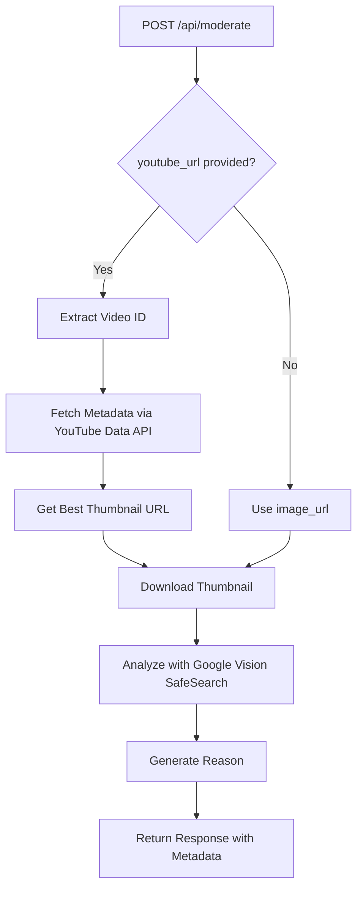

# YouTube Video Moderation Feature

## Overview
The `/api/moderate` endpoint has been enhanced to support **YouTube video URL moderation**. This allows you to analyze YouTube video thumbnails for inappropriate content using Google Cloud Vision SafeSearch API.

---

## Features

### 🎥 Two Moderation Modes

#### 1. **Direct Image Moderation** (Original)
Pass any image URL directly for analysis.

```json
{
  "image_url": "https://example.com/image.jpg"
}
```

#### 2. **YouTube Video Moderation** (New ✨)
Pass a YouTube video URL to:
1. Extract video ID
2. Fetch video metadata (title, channel)
3. Get best quality thumbnail
4. Analyze thumbnail for safety

```json
{
  "youtube_url": "https://www.youtube.com/watch?v=dQw4w9WgXcQ"
}
```

---

## API Endpoint

### `POST /api/moderate`

**Supported YouTube URL Formats:**
```
✅ https://www.youtube.com/watch?v=VIDEO_ID
✅ https://youtu.be/VIDEO_ID
✅ https://www.youtube.com/shorts/VIDEO_ID
✅ https://www.youtube.com/embed/VIDEO_ID
```

---

## Request Examples

### Example 1: Direct Image Moderation
```bash
curl -X POST "http://localhost:8000/api/moderate" \
  -H "Content-Type: application/json" \
  -d '{
    "image_url": "https://example.com/thumbnail.jpg"
  }'
```

### Example 2: YouTube Video Moderation
```bash
curl -X POST "http://localhost:8000/api/moderate" \
  -H "Content-Type: application/json" \
  -d '{
    "youtube_url": "https://www.youtube.com/watch?v=dQw4w9WgXcQ"
  }'
```

### Example 3: YouTube Shorts
```bash
curl -X POST "http://localhost:8000/api/moderate" \
  -H "Content-Type: application/json" \
  -d '{
    "youtube_url": "https://www.youtube.com/shorts/JkV-BbqA6L0"
  }'
```

---

## Response Format

### Safe Content Response (200 OK)
```json
{
  "allowed": true,
  "safe": true,
  "reason": "Content is safe. No inappropriate content detected.",
  "categories": {
    "adult": false,
    "violence": false,
    "racy": false,
    "medical": false,
    "spoof": false
  },
  "likelihood_scores": {
    "adult": "VERY_UNLIKELY",
    "violence": "UNLIKELY",
    "racy": "VERY_UNLIKELY",
    "medical": "UNLIKELY",
    "spoof": "VERY_UNLIKELY"
  },
  "threshold": "POSSIBLE",
  "service": "google_cloud_vision",
  "thumbnail_url": "https://i.ytimg.com/vi/dQw4w9WgXcQ/maxresdefault.jpg",
  "video_title": "Never Gonna Give You Up",
  "channel_title": "Rick Astley"
}
```

### Unsafe Content Response (200 OK)
```json
{
  "allowed": false,
  "safe": false,
  "reason": "Content flagged as UNSAFE. Detected: adult, racy.",
  "categories": {
    "adult": true,
    "violence": false,
    "racy": true,
    "medical": false,
    "spoof": false
  },
  "likelihood_scores": {
    "adult": "LIKELY",
    "violence": "UNLIKELY",
    "racy": "POSSIBLE",
    "medical": "UNLIKELY",
    "spoof": "VERY_UNLIKELY"
  },
  "threshold": "POSSIBLE",
  "service": "google_cloud_vision",
  "thumbnail_url": "https://i.ytimg.com/vi/VIDEO_ID/maxresdefault.jpg",
  "video_title": "Video Title",
  "channel_title": "Channel Name"
}
```

---

## Response Fields

| Field | Type | Description |
|-------|------|-------------|
| `allowed` | boolean | Whether content is safe (true) or unsafe (false) |
| `safe` | boolean | Same as `allowed` (for backward compatibility) |
| `reason` | string | **NEW** Human-readable explanation of the decision |
| `categories` | object | Which safety categories were flagged |
| `likelihood_scores` | object | Confidence levels for each category |
| `threshold` | string | Threshold used for flagging (POSSIBLE, LIKELY, etc.) |
| `service` | string | Moderation service used (google_cloud_vision) |
| `thumbnail_url` | string | **NEW** Thumbnail URL (YouTube mode only) |
| `video_title` | string | **NEW** Video title (YouTube mode only) |
| `channel_title` | string | **NEW** Channel name (YouTube mode only) |

---

## Safety Categories

The following categories are checked by Google Cloud Vision SafeSearch:

1. **Adult** - Adult content, nudity
2. **Violence** - Violent or bloody content
3. **Racy** - Suggestive or provocative content (but not explicit)
4. **Medical** - Medical or surgical content
5. **Spoof** - Fake or manipulated content

---

## Thumbnail Quality Selection

The system automatically selects the best available thumbnail:

1. **First Try**: `maxresdefault.jpg` (1280x720) - High quality
2. **Fallback**: `hqdefault.jpg` (480x360) - Medium quality

**Thumbnail URL Format:**
```
https://i.ytimg.com/vi/{VIDEO_ID}/{quality}.jpg
```

---

## Error Handling

### Invalid Request (400)
```json
{
  "detail": "Either image_url or youtube_url must be provided"
}
```

```json
{
  "detail": "Provide either image_url or youtube_url, not both"
}
```

```json
{
  "detail": "Invalid YouTube URL: Could not extract video ID from URL"
}
```

### Missing API Key (500)
```json
{
  "detail": "YouTube API key not configured. Set YOUTUBE_API_KEY in environment."
}
```

### YouTube API Error (500)
```json
{
  "detail": "Failed to fetch YouTube data: Video not found"
}
```

### Vision API Error (500)
```json
{
  "detail": "Internal server error: Failed to download image"
}
```

---

## Implementation Details

### Process Flow (YouTube Mode)



### Files Modified

1. **`app/models/moderation_request.py`**
   - Added `youtube_url` field to `ModerationRequest`
   - Added `reason`, `thumbnail_url`, `video_title`, `channel_title` to `ModerationResponse`

2. **`app/routes/moderation.py`**
   - Updated `/api/moderate` endpoint to support YouTube URLs
   - Added YouTube mode logic
   - Added reason generation

3. **`app/services/youtube_service.py`** (NEW)
   - `extract_video_id()` - Parse YouTube URLs
   - `fetch_video_metadata()` - Call YouTube Data API v3
   - `get_best_thumbnail_url()` - Select best quality thumbnail
   - `analyze_youtube_video()` - Complete workflow

---

## Configuration

### Environment Variables

Add to `.env`:
```properties
YOUTUBE_API_KEY=your_youtube_api_key_here
```

The YouTube API key is required for YouTube video moderation. Get it from:
[Google Cloud Console](https://console.cloud.google.com/)

---

## Testing

### Test with Python
```python
import requests

# Test YouTube video moderation
response = requests.post(
    "http://localhost:8000/api/moderate",
    json={"youtube_url": "https://www.youtube.com/watch?v=dQw4w9WgXcQ"}
)

print(response.json())
```

### Test with cURL
```bash
# Safe video
curl -X POST "http://localhost:8000/api/moderate" \
  -H "Content-Type: application/json" \
  -d '{"youtube_url": "https://www.youtube.com/watch?v=dQw4w9WgXcQ"}'

# YouTube Short
curl -X POST "http://localhost:8000/api/moderate" \
  -H "Content-Type: application/json" \
  -d '{"youtube_url": "https://www.youtube.com/shorts/JkV-BbqA6L0"}'
```

### Expected Output
```json
{
  "allowed": true,
  "safe": true,
  "reason": "Content is safe. No inappropriate content detected.",
  "categories": {
    "adult": false,
    "violence": false,
    "racy": false,
    "medical": false,
    "spoof": false
  },
  "likelihood_scores": {
    "adult": "VERY_UNLIKELY",
    "violence": "UNLIKELY",
    "racy": "VERY_UNLIKELY",
    "medical": "UNLIKELY",
    "spoof": "VERY_UNLIKELY"
  },
  "threshold": "POSSIBLE",
  "service": "google_cloud_vision",
  "thumbnail_url": "https://i.ytimg.com/vi/dQw4w9WgXcQ/maxresdefault.jpg",
  "video_title": "Rick Astley - Never Gonna Give You Up (Official Video)",
  "channel_title": "Rick Astley"
}
```

---

## API Documentation

Interactive API documentation available at:
- **Swagger UI**: http://localhost:8000/docs
- **ReDoc**: http://localhost:8000/redoc

---

## Use Cases

### 1. Browser Extension
Filter YouTube content in real-time:
```javascript
async function checkVideo(youtubeUrl) {
  const response = await fetch('http://localhost:8000/api/moderate', {
    method: 'POST',
    headers: { 'Content-Type': 'application/json' },
    body: JSON.stringify({ youtube_url: youtubeUrl })
  });
  
  const result = await response.json();
  
  if (!result.safe) {
    console.log(`Blocked: ${result.reason}`);
    // Hide or blur video
  }
}
```

### 2. Parental Control App
Monitor children's video consumption:
```python
def is_kid_friendly(youtube_url):
    response = requests.post(
        "http://localhost:8000/api/moderate",
        json={"youtube_url": youtube_url}
    )
    data = response.json()
    return data["safe"], data["reason"]

safe, reason = is_kid_friendly("https://www.youtube.com/shorts/VIDEO_ID")
if not safe:
    print(f"⚠️ Warning: {reason}")
```

### 3. Content Moderation Dashboard
Bulk check videos:
```python
videos = [
    "https://www.youtube.com/watch?v=VIDEO1",
    "https://www.youtube.com/watch?v=VIDEO2",
    "https://www.youtube.com/shorts/VIDEO3",
]

for url in videos:
    response = requests.post(
        "http://localhost:8000/api/moderate",
        json={"youtube_url": url}
    )
    result = response.json()
    print(f"{result['video_title']}: {'✅ Safe' if result['safe'] else '❌ Unsafe'}")
    print(f"  Reason: {result['reason']}")
```

---

## Limitations

1. **Thumbnail-Only Analysis**
   - Analyzes thumbnail image, not full video content
   - Some inappropriate content may not be visible in thumbnail

2. **API Quota**
   - YouTube Data API: 10,000 units/day (default)
   - Each video analysis: ~1 unit
   - Google Cloud Vision: 1,000 requests/month (free tier)

3. **Thumbnail Availability**
   - `maxresdefault` not available for all videos
   - Falls back to `hqdefault` automatically

---

## Security Considerations

1. **API Key Protection**
   - Never expose YouTube API key in client-side code
   - Use environment variables
   - Restrict API key in Google Cloud Console

2. **Rate Limiting**
   - Consider implementing rate limiting for production
   - Monitor API usage in Google Cloud Console

3. **Input Validation**
   - URL validation prevents injection attacks
   - Regex-based video ID extraction

---

## Troubleshooting

### Issue: "YouTube API key not configured"
**Solution**: Add `YOUTUBE_API_KEY` to `.env` file

### Issue: "Could not extract video ID from URL"
**Solution**: Ensure URL is in supported format:
```
✅ https://www.youtube.com/watch?v=VIDEO_ID
✅ https://youtu.be/VIDEO_ID
✅ https://www.youtube.com/shorts/VIDEO_ID
❌ https://www.youtube.com/playlist?list=...
```

### Issue: "Video not found"
**Solution**: 
- Check if video exists and is public
- Verify video ID is correct
- Ensure YouTube API key has correct permissions

### Issue: Thumbnail 404 error
**Solution**: 
- System automatically falls back to `hqdefault`
- Some videos may not have `maxresdefault` available

---

## Performance

- **YouTube Metadata Fetch**: ~500ms
- **Thumbnail Download**: ~200-500ms
- **Vision API Analysis**: ~1-2 seconds
- **Total Processing Time**: ~2-3 seconds

---

## Future Enhancements

1. **Full Video Analysis** (Optional)
   - Integrate with `/api/analyze_video` endpoint
   - Analyze captions/transcript with Gemini AI

2. **Caching**
   - Cache moderation results by video ID
   - Reduce API calls for frequently checked videos

3. **Batch Processing**
   - Accept multiple YouTube URLs in one request
   - Return array of results

4. **Webhook Support**
   - Async processing for large batches
   - Callback URL for results

---

## Summary

✅ **YouTube video moderation now supported**
✅ **Automatic thumbnail extraction**
✅ **Video metadata included in response**
✅ **Human-readable safety reasons**
✅ **Backward compatible with image URLs**
✅ **Comprehensive error handling**
✅ **Production-ready implementation**

---

*Last Updated: November 2025*
*Version: 2.0*
